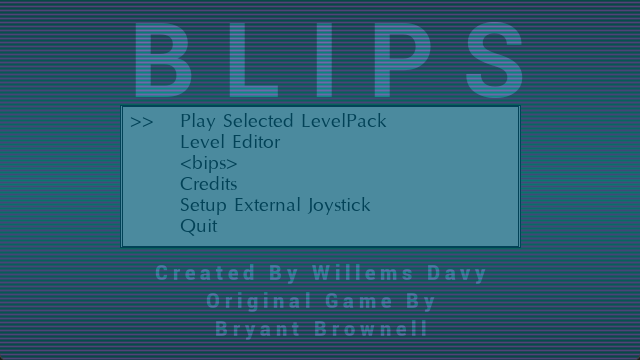

# Blips
   

Blips is a remake of the dos bips original, gold and platinum game made by Bryant Brownell, its a sokoban style puzzle game but with exploding dynamite, special boxes and collecting coins

## Screenshots



## Game Features:
- 26 Levels of original Bips game
- 18 Levels of original Bips Gold game
- 25 Levels of original Bips Platinum game
- Level Editor (Create your own Level Packs)
- Autosaves progress

## Playing the Game:
The aim of the game is to collect all the dollar coins in a level, you need to create pathways to these coins by pushing boxes around or even make them explode by pushing them into the dynamite

## Command Line Parameters
```
Blips.exe [-w <WIDTH>] [-h <HEIGHT>] [-f] [-ns] [-a] [-fps] [-nd] [-nj]

Commands:
  -w <WIDTH>: use <WIDTH> as window width
  -h <HEIGHT>: use <HEIGHT> as window height
  -f: Run fullscreen
  -ns: No Sound
  -s: Use Software rendering (default is hardware accelerated)
  -fps: Show fps
  -nd: no fps delay (run as fast as possible)
  -nj: disable joystick input
```

## Controls Gamepad (xbox controller)

| Button | Action |
| ------ | ------ |
| A | Confirm in menus, level selector and questions asked, place a part in the level editor, Switch players if 2 players exists |
| B | Quit to title screen on the level selector, Quit to level selector in game and level editor mode. Quit the game on the titlescreen |
| Y | In Level editor Mode, Create a new level when being in the level selector. In the level editor itself erase all parts from the screen. Inside the game itself restart the level |
| X	| In the level editor, center the level on screen |
| JOYSTICK | move main player |
| SELECT | Show statistics during a game. Hide the part position/grid in the level editor |
| L | At the level Selector decrease selected level with 5, During game play select the next Skin. In the level editor select previous part |
| R | At the level Selector increase selected level with 5, During game play select next music. In the level editor select next part. |
| START | Test level when being in the level editor, go back to level editor after testing, Restart the current level |
| Y + JOYSTICK | When playing a level you can look around in the level freely |

## Controls (Keyboard)

| Button | Action |
| ------ | ------ |
| A, SPACE, RETURN | Confirm in menus, level selector and questions asked, place a part in the level editor, Switch players if 2 players exists |
| B | Show statistics during a game. Hide the part position/grid in the level editor |
| Y | In Level editor Mode, Create a new level when being in the level selector. In the level editor itself erase all parts from the screen. Inside the game itself restart the level |
| X	| In the level editor, center the level on screen |
| Arrow Keys |	move main player |
| ESCAPE | Quit to title screen on the level selector, Quit to level selector in game and level editor mode. Quit the game on the titlescreen |
| L, PAGEDOWN | At the level Selector decrease selected level with 5, During game play select the next Skin. In the level editor select previous part |
| R, PAGEUP | At the level Selector increase selected level with 5, During game play select next music. In the level editor select next part. |
| RETURN | Test level when being in the level editor, go back to level editor after testing, Restart the current level |
| Y + Arrow keys | When playing a level you can look around in the level freely |

## SDL1 version
An SDL1 Version is available in the [SDL1_Version](https://github.com/joyrider3774/blips/tree/SDL1_Version) branch

## Credits
Game is a remake of dos bips, bips gold and bips platinum game made by Bryant Brownell and based on the gp2x version i initially made

### Libraries
- SDL
- SDL_MIXER
- SDL_TTF
- SDL_GFX
- SDL_IMAGE

### Level authors
- Bryant Brownell
- Landon Brownell
- Caryn Brownell
- The PocoMan Team

### Music
Music was made by donskeeto

### Graphics
- dollar coin - [kenney game assets all in 1](https://kenney.itch.io/kenney-game-assets) - [CC0 1.0 Universal](https://creativecommons.org/publicdomain/zero/1.0/)
- wall: [1001.com](https://opengameart.org/content/sokoban-pack) - [Attribution-ShareAlike 3.0 Unported](https://creativecommons.org/licenses/by-sa/3.0/)
- floor: [Kenney Sokoban tiles](https://opengameart.org/content/sokoban-100-tiles) - [CC0 1.0 Universal](https://creativecommons.org/publicdomain/zero/1.0/)
- player: [Kenney Sokoban tiles](https://opengameart.org/content/sokoban-100-tiles) - [CC0 1.0 Universal](https://creativecommons.org/publicdomain/zero/1.0/)
- box: [SpriteAttack boxes and crates](https://opengameart.org/content/boxes-and-crates-svg-and-pngs) - [CC0 1.0 Universal](https://creativecommons.org/publicdomain/zero/1.0/)
- dynamite: [GUI Icons by Rexard](https://www.gamedevmarket.net/asset/gui-icons-8656) - I Payed for this asset do not reuse !

### Sound
- stageend.wav: [game music stingers and ui sfx pack 2](https://www.gamedevmarket.net/asset/game-music-stingers-and-ui-sfx-pack-2/) - I Payed for this Asset do not reuse !
- "move " - created by me (willems davy) using BXFR - feel free to use


